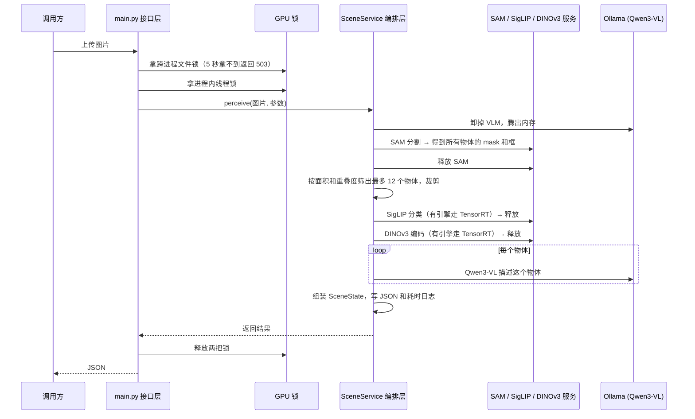
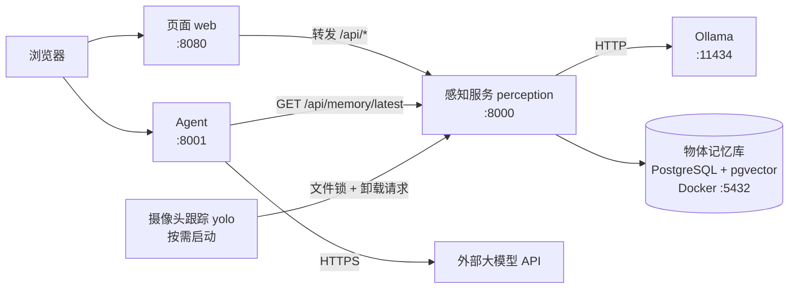

# RoomMind 后端架构梳理

这份文档回答四个问题：整个部署工作是怎么一步步做下来的；后端各模块分别负责什么、边界划在哪里；系统的上限卡在哪里、为什么；理解这些需要哪些基础知识。

GPU、TensorRT、显存相关的细节在 `模型部署经验.md`，这里只在需要时引用，不重复展开。

> 说明：除"Jetson 实测"一节外，文中的耗时和显存数字都是估算或代码里的默认值。上板后应该用 `tegrastats` 和 `tests/tmp/*_profile.log` 替换。

---

## 一、整个过程梳理

### 1. 起点：项目原来是什么样

开始部署之前，RoomMind 已经有三个可以单独运行的程序：

- **感知服务**（Python + FastAPI，`:8000`）：YOLO、SAM、Grounding DINO、SigLIP2、DINOv3 五个模型，外加通过 Ollama 调用的 Qwen3-VL。
- **页面**（Node + Hono，`:8080`）：上传图片、看摄像头，把请求转发给感知服务。
- **Agent**（Node + Express，`:8001`）：对话服务，调用外部大模型 API，唯一的工具 `status` 读的是一个还没接上的"数据库桩"。

它们都是开发时手动开三个终端跑起来的，没有部署方案，也没有显存规划。

### 2. 部署工作做了哪几步

| 步骤 | 做了什么 | 为什么 |
| --- | --- | --- |
| 看现状 | 读各服务的启动方式、模型加载方式 | 先弄清楚每个模型什么时候加载、什么时候释放 |
| 选部署方式 | systemd 单机多服务 | 板子只有一块，Docker 在 Jetson 上要额外处理 GPU 运行时和大镜像；先把性能问题解决，再考虑容器化 |
| 显存预算 | 8GB 中留 1.8GB 给系统和常驻进程，剩约 6.4GB 作为"一个模型的槽位" | Jetson 是 CPU、GPU 共用内存，每个模型单独放得下，但不能同时放 |
| 运行策略 | 同一时刻只留一个占 GPU 的模型 | 推理时的激活值峰值测不准，互斥最稳 |
| 选 TensorRT | 只给 YOLO、DINOv3、SigLIP 图像塔做引擎 | 这三个输入形状固定、算子普通、调用频繁 |
| 实现 | `app/inference/trt/` 模块、`deploy/jetson/` 脚本、单元测试 | 见下文模块划分 |
| 精简 | 合并重复代码、减少配置开关、四个 systemd 文件合成一个模板 | 代码从约 830 行减到 530 行，行为不变 |
| 总结 | `模型部署经验.md` 和本文 | 学习和面试用 |

### 3. 一次请求是怎么走完的

以最复杂的 `POST /api/scene`（一张图 → 场景里每个物体的类别、向量、描述）为例：



这张图里能看到后面要讲的几乎所有要点：两把锁、模型轮流装卸、TensorRT 和 PyTorch 自动切换、VLM 按物体逐个调用。

---

## 二、后端模块划分

### 1. 第一层：进程（服务）怎么拆



| 服务 | 职能 | 占 GPU | 状态 |
| --- | --- | --- | --- |
| 页面 `roomind@web` | 返回静态页面；把 `/api/*` 原样转发给感知服务；直接读 `tests/tmp/` 给出结果图 | 否 | 无状态 |
| Agent `roomind@agent` | 对话循环：调外部大模型，模型要求时执行工具，返回回答；负责上下文压缩 | 否 | 无状态（对话历史由调用方每次带上） |
| 感知 `roomind@perception` | 所有视觉模型推理；GPU 调度；部署状态查询 | 是 | 有状态（进程里装着模型） |
| Ollama | 装载和运行 Qwen3-VL | 是 | 有状态 |
| 摄像头跟踪 `roomind@yolo` | 持续读摄像头，YOLO 检测 + ByteTrack 跟踪 | 是 | 有状态，默认不启动 |

**拆分的依据是"是否占 GPU"和"是否需要单独发布"：**

- 页面和 Agent 不碰 GPU，崩了、重启了都不影响推理，所以各自独立。
- 五个视觉模型没有拆成五个服务，而是放在一个感知进程里。原因是每个用 GPU 的进程都要单独占一份几百 MB 的 CUDA 上下文，8GB 的板子承担不起。
- Ollama 是第三方程序，本来就是独立进程，只通过 HTTP 让它装载或卸载模型。
- 摄像头跟踪要一直运行，而感知服务是"来一个请求处理一个"，两种运行方式不同，所以分开。代价是两者要抢 GPU，需要文件锁协调。

### 2. 第二层：感知服务内部的分层

感知服务是后端的主体，内部分成六层。依赖方向是从上往下，下层不知道上层的存在。

```text
┌──────────────────────────────────────────────────────────────┐
│ 接口层     app/main.py                                        │
│            HTTP 参数校验、错误码转换、加锁、日志                │
├──────────────────────────────────────────────────────────────┤
│ 编排层     app/inference/scene/                               │
│            把多个模型串成一条流水线，决定顺序和装卸时机          │
├──────────────────────────────────────────────────────────────┤
│ 模型服务层 */service.py                                       │
│            懒加载模型、解码图片、声明 GPU 占用、提供 release()   │
├──────────────────────────────────────────────────────────────┤
│ 模型实现层 detector.py / generator.py / encoder.py /          │
│            classifier.py / vlm/adapter.py                     │
│            真正加载权重、跑推理、选 TensorRT 还是 PyTorch        │
├──────────────────────────────────────────────────────────────┤
│ 推理基础设施 app/inference/trt/                                │
│            部署计划、GPU 占位、跨进程锁、TensorRT 引擎、导出     │
├──────────────────────────────────────────────────────────────┤
│ 公共工具   memory.py / weights.py / image.py / camera/        │
│            设备选择、释放显存、下载权重、图片解码、摄像头         │
└──────────────────────────────────────────────────────────────┘
```

逐层说明：

**接口层 `app/main.py`**
- 职能：定义 HTTP 接口；用 FastAPI 的 `Query`、`Form` 校验参数范围；把 `ValueError` 转成 400、把显存不足等 `RuntimeError` 转成 503、把 `GpuBusy` 转成 503；推理前先拿文件锁再拿线程锁；用 `asyncio.to_thread` 把推理放进线程，不阻塞事件循环。
- 边界：不写任何模型逻辑，不知道模型怎么加载。它只调用 `xxx_service.方法()`。

**编排层 `app/inference/scene/`**
- 职能：`SceneService.perceive()` 决定"先 SAM，再筛选，再 SigLIP、DINOv3，最后 VLM"，每一步用完就调 `release()`。`select.py` 负责按面积和重叠度（IoU）筛物体；`codec.py` 负责裁剪和编码；`profile.py` 记录每一步的耗时和显存。
- 边界：只依赖模型服务层的接口，不直接碰权重和设备。它不知道 SigLIP 这次走的是 TensorRT 还是 PyTorch。

**模型服务层 `yolo/service.py`、`sam/service.py`、`dino/service.py`、`siglip/service.py`、`dinov3/service.py`、`vlm/service.py`**
- 职能：这一层写法统一，每个服务都做三件事：
  1. **懒加载**：第一次调用时才创建底层模型对象，服务启动时不占内存。
  2. **声明占用**：推理前调用 `claim_gpu("sam", self.release)`，由占位表把上一个模型卸掉。
  3. **提供 `release()`**：丢掉模型对象，归还显存。
- 边界：负责"什么时候加载、什么时候释放"，不负责"怎么推理"。

**模型实现层**
- 职能：加载权重、预处理、推理、后处理。SigLIP 和 DINOv3 在这一层决定用 TensorRT 引擎还是 PyTorch（`_try_tensorrt()`），YOLO 由 `select_yolo_weights()` 选 `.engine` 还是 `.pt`。VLM 的 `adapter.py` 是一个适配器，把 Ollama 的 HTTP 接口包成 `describe_object()`、`analyze()` 这样的方法。
- 边界：不知道 HTTP，不知道还有其他模型在排队。

**推理基础设施 `app/inference/trt/`**

| 文件 | 职能 |
| --- | --- |
| `plan.py` | 部署计划：每个模型用什么运行时、预算多少、为什么；判断该不该用引擎 |
| `budget.py` | 进程内的 GPU 占位表：同一时刻只记一个模型，换人时先让上一个释放 |
| `lease.py` | 跨进程的 GPU 文件锁；通知感知服务卸载模型 |
| `engine.py` | 加载和执行 TensorRT 引擎 |
| `export.py` | 在板上把模型导出成 ONNX 并编译成引擎（命令行工具） |
| `cache.py` | SigLIP 文本向量的缓存读写 |

- 边界：这一层只提供机制（锁、占位、引擎），不决定业务流程。

**公共工具**
- `memory.py`：选设备（CUDA、MPS、CPU）、选精度、识别 OOM、释放显存、统计峰值。
- `weights.py`：本地没有权重时从 Hugging Face（或镜像）下载。
- `image.py`：图片字节解码成 RGB。
- `camera/`：列出设备、打开摄像头、按帧率读帧。

### 3. Agent 内部的划分

```text
server.ts   HTTP 层：解析请求、错误分类（502/504/500）、客户端断开时取消（499）
agent.ts    循环：调模型 → 模型要工具就执行 → 结果放回对话 → 再调模型，最多 10 步
compact.ts  上下文压缩：保留最近 10 轮，更早的交给模型总结成一段
tools/      工具：目前只有 status
db/         存储接口 SpaceStatusStore；perception.ts 通过 HTTP 读感知服务的记忆库，stub.ts 和 memory.ts 给测试用
```

这里用了"依赖接口而不是实现"的写法：`StatusTool` 只认 `SpaceStatusStore` 接口。接入物体记忆库时，只新增了一个 `PerceptionSpaceStatusStore` 实现，工具和 Agent 循环一行没改。

### 4. 边界规则汇总

这几条是模块之间的"约定"。以后加功能时照着做，结构就不会乱：

1. **HTTP 只出现在接口层。** 服务层和实现层抛普通 Python 异常，由 `main.py` 翻译成状态码。
2. **GPU 调度只走两个入口。** 进程内用 `claim_gpu()`，跨进程用 `GpuLease`。任何模型都不自己判断"现在能不能用 GPU"。
3. **运行时选择只在实现层。** TensorRT 还是 PyTorch 对上层透明，上层拿到的结果格式一样。
4. **Ollama 的细节只在 `vlm/adapter.py`。** 换成别的 VLM 后端时，只改这一个文件。
5. **Agent 不触发推理，也不碰 GPU。** 感知结果先写进物体记忆库，Agent 只通过 `GET /api/memory/latest` 读已有结果。这个接口不拿 GPU 锁，推理正在进行时也能立即返回，所以感知的节奏（慢、会排队）和对话的节奏（要快）互不牵连。
6. **记忆库只有一个所有者。** PostgreSQL 只有感知服务直连，别的服务一律走 HTTP。以后改表结构，只影响 `app/object_memory.py`。数据库本身是独立的容器，崩了不影响推理；连不上时接口返回 503。
7. **页面只做转发和展示。** 不写业务逻辑，感知服务换地址只改 `ROOMIND_API`。

### 5. 现在边界上的几处"不干净"

如实列出，方便以后改：

- **编排层知道了内存细节。** `SceneService` 直接调用 `unload_model()`，还通过 `also_release` 接收 DINO 和 YOLO 服务，只为了在开始前把它们卸掉。这件事本该交给 `claim_gpu()` 统一处理。
- **卸载接口手动列出所有服务。** `POST /api/deploy/release` 在 `main.py` 里写死了五个服务。新加一个模型时容易漏掉。可以改成由占位表统一记录"当前谁占着"，只卸那一个。
- **页面直接读感知服务的输出目录。** 页面的 `/api/artifacts/` 从本机 `tests/tmp/` 读文件，这意味着页面和感知服务必须在同一台机器上。感知服务本身也有同名接口，页面转发给它即可，不必自己读盘。
- **结果文件还在 `tests/tmp/`。** 物体记忆已经进了 PostgreSQL，但场景 JSON、标注图、耗时日志仍写在测试目录里。
- **记忆库只存"每个画面"，还不认"同一个物体"。** 目标架构里的跨画面匹配（用 DINOv3 向量判断是不是已有物体）和状态判定（新增、移除、移动）都没做。Agent 现在只能看到最新一个画面。

---

## 三、上限在哪里，为什么

"上限"分两类：一类是**一个请求最快多快**（延迟），一类是**同一时间能处理多少请求**（吞吐）。下面按影响从大到小排列。

### Jetson 实测（2026-09-26，还没有 TensorRT 引擎，全走 PyTorch）

一张 1024×768 的卧室照片，`max_objects=4`：

| 步骤 | 耗时 | 峰值显存 | 感知进程常驻内存 |
| --- | --- | --- | --- |
| SAM | 14.0s | 534MB | 2.1GB |
| SigLIP2 | 8.1s | 888MB | 2.8GB |
| DINOv3 | 0.5s | 116MB | 2.1GB |
| VLM × 4 | 每个约 110s | Ollama 报告 900MB | 1.5～2.0GB |
| **合计** | **488s** | | |

从这张表能读出三件事：

1. **VLM 占了 90% 的时间。** 感知进程释放模型后仍常驻约 2GB（CUDA 上下文和 torch 本身），Ollama 看到的可用内存不够，只把 Qwen3-VL 的一部分层放上 GPU，其余在 CPU 上算，所以每个物体要将近两分钟。这印证了下面第 3 条"VLM 逐个调用"是最大的延迟来源。
2. **上下文长度直接决定 VLM 能不能起来。** 原来 `NUM_CTX=25600`，KV cache 申请不到内存，Ollama 直接启动失败。改成 4096 之后才跑通，因为一次请求实际只需要约 1.5K token。
3. **页缓存会挡住 GPU 分配。** 刚读完 1.5GB 的 SigLIP 权重时，系统显示"可用 3.7GB"，但其中 3.2GB 是页缓存，Jetson 的 GPU 分配器（NvMap）申请不到内存，报 `error 12`。手动 `echo 3 > /proc/sys/vm/drop_caches` 之后就好了。这是统一内存特有的问题，在 Mac 上复现不出来。

### 1. 并发上限 = 1：统一内存决定了只能串行

- **现象**：感知服务同一时刻只处理一个推理请求。第二个请求要么等线程锁，要么 5 秒内拿不到文件锁直接返回 503。
- **原因**：8GB 统一内存放不下两个大模型同时推理。设计上有两道闸：`_inference_lock`（进程内）和 `GpuLease`（跨进程）。这是**有意为之**，用吞吐换稳定，避免 OOM 把整个进程打崩。
- **连带影响**：摄像头跟踪和场景感知不能同时运行。跟踪一开，感知接口就一直返回 503。
- **能怎么提**：
  - 小模型同时常驻：三个 TensorRT 引擎加起来预算约 1.6GB，放得下，可以不再互相卸载。
  - 把"立即 503"换成排队：请求进队列，返回任务编号，调用方轮询结果。
  - 把 VLM 挪到另一台机器或云端，板子上只跑视觉小模型。

### 2. 延迟上限：模型反复装卸（冷启动）

- **现象**：同一张图连续调两次 `/api/scene`，第二次并不会快多少。
- **原因**：场景流水线每次都要依次装载 SAM → SigLIP → DINOv3 → Qwen3-VL，每个用完立刻释放。从磁盘读权重、搬进 GPU、TensorRT 反序列化都要时间，Ollama 第一次加载 VLM 甚至要几分钟。对单次请求来说，**装卸时间往往比推理本身还长**。
- **为什么还这么做**：激活值峰值测不准，互斥是最保守的选择。先保证不崩，再测出实际峰值，然后逐步放开。
- **能怎么提**：实测每个模型的峰值后，把能共存的模型（比如 SigLIP + DINOv3 两个引擎）改成常驻；只在需要 SAM 或 VLM 时才腾地方。

### 3. 延迟上限：VLM 按物体逐个调用

- **现象**：物体越多，场景接口越慢，大致成正比。
- **原因**：编排层对每个物体单独调用一次 `describe_object()`，默认最多 12 个物体就是 12 次大模型生成。每次都要处理一张图片、生成一段文字，这是整条流水线里最慢的一段。
- **能怎么提**：减小 `max_objects`；把多个物体的裁剪图拼进一次请求；只对"新出现或变化了"的物体调用 VLM（这正是目标架构里 Object Memory 和状态判定要做的事）。

### 4. 显存峰值上限：SAM 的逐点循环

- **现象**：SAM 是最容易 OOM 的模型，预算 2.8GB，是 YOLO 的 7 倍。
- **原因**：自动分割会在图上撒一个 16×16 = 256 个点的网格，每批 8 个点，一共跑 32 批。每批的中间结果和 `points_per_batch` 成正比；图片最长边默认 1024，分辨率越高，特征图越大。
- **能怎么提**：接口已经暴露了 `points_per_batch`、`points_per_crop`、`max_size` 三个参数，内存紧张时调小。把 SAM 换成 TensorRT 没用，因为瓶颈在循环本身。

### 5. 灵活性上限：TensorRT 静态引擎

- **现象**：YOLO 走引擎时，请求的 `imgsz` 不是 640 就直接拒绝；SigLIP 改了类别表，就会自动退回 PyTorch。
- **原因**：静态引擎在编译时就固定了输入形状，换来最快的速度和最少的内存。SigLIP 的文本向量是导出时算好的，类别变了缓存就失效。
- **能怎么提**：真需要多种尺寸时，用动态形状（optimization profile）重新编译，代价是内存按最大尺寸预留。

### 6. 扩展性上限：有状态、单机

- **现象**：没办法像普通 Web 服务那样"多开几个实例"来扛更多请求。
- **原因**：感知服务是**有状态**的，模型装在进程内存里；`_holder`（占位表）、`_camera_info` 都是进程里的全局变量；GPU 又只有一块。多开实例只会抢同一块内存。
- **对比**：页面和 Agent 是无状态的，理论上可以多开，但它们本来就不是瓶颈。

### 7. Agent 的上限

- **单轮最多 10 步**：模型连续调用工具超过 10 次就停止，防止死循环和费用失控。
- **只有一个工具，数据还是空的**：这是功能上限，不是性能上限。
- **延迟取决于外部 API**：Agent 本身几乎不耗时，慢的是网络和大模型生成。
- **上下文会膨胀**：对话越长，每次发给模型的内容越多、越贵，所以有"保留最近 10 轮、更早的压缩成摘要"的机制。

### 8. 不是瓶颈的地方

- **页面转发**：只是把请求流式地转给感知服务，几乎不增加耗时。
- **健康检查**：页面每 5 秒请求一次 `/openapi.json`，开销很小，只是会刷日志。
- **FastAPI 本身**：推理动辄几百毫秒到几十秒，框架那点开销可以忽略。

### 一张表总结

| 上限 | 卡在哪 | 根本原因 | 第一步怎么改 |
| --- | --- | --- | --- |
| 并发 = 1 | 两把锁 | 8GB 统一内存 | 小模型常驻、请求排队 |
| 装卸耗时 | 场景流水线 | 保守的互斥策略 | 实测峰值后让能共存的模型常驻 |
| VLM 逐个调用 | 编排层循环 | 每个物体一次生成 | 只描述变化的物体 |
| SAM 显存峰值 | 逐点循环 | 每批点数 × 分辨率 | 调小三个参数 |
| 输入尺寸固定 | 静态引擎 | 编译时定形状 | 需要时用动态形状 |
| 不能横向扩展 | 感知进程 | 有状态 + 单 GPU | 把重模型挪到服务器 |

---

## 四、涉及的基础知识

GPU、TensorRT、量化、统一内存等内容见 `模型部署经验.md` 的附录。这里只讲后端架构相关的概念。

### 进程、线程和并发

- **进程和线程。** 进程是操作系统分配资源的单位，有自己独立的内存；线程是进程里的执行单位，同一进程的线程共享内存。所以模型装在感知进程里时，这个进程的所有线程都能用它，但别的进程用不了。
- **GIL（全局解释器锁）。** CPython 同一时刻只让一个线程执行 Python 代码。不过 PyTorch、TensorRT 在做 GPU 计算时会释放 GIL，所以 GIL 不是这里的瓶颈，GPU 内存才是。
- **asyncio 和事件循环。** FastAPI 的 `async def` 接口跑在一个事件循环里，适合"等网络、等磁盘"这类事情。一个请求在做耗时的计算时，如果不交出控制权，整个服务都会卡住。
- **`asyncio.to_thread`。** 把耗时的同步函数（比如模型推理）放到线程池里运行，事件循环可以继续处理别的请求，比如健康检查和摄像头流。
- **锁（Lock）。** 保证同一时刻只有一个执行者进入某段代码。`threading.Lock` 管同一进程的线程，文件锁 `flock` 管不同进程。
- **死锁和超时。** 两个执行者互相等对方的锁，就会永远卡住。本项目给文件锁设了超时（感知 5 秒、跟踪 60 秒、导出 120 秒），拿不到就报错，而不是一直等。

### 分层和设计模式

- **分层架构。** 按职责把代码分成几层，上层调用下层，下层不知道上层。好处是改一层不会牵连其他层，比如把 SigLIP 从 PyTorch 换成 TensorRT，只改了实现层。
- **依赖方向。** 判断分层好不好，就看有没有"下层反过来依赖上层"。本项目 `budget.py` 需要卸载 Ollama 时，是在函数里临时导入 `vlm.adapter`，就是为了避免两个模块在加载时互相导入（循环依赖）。
- **编排（Orchestration）。** 由一个专门的模块决定"先做什么、后做什么"，被调用的模块只管做好自己那件事。`SceneService` 就是编排者。
- **适配器模式（Adapter）。** 把一个外部系统的接口包装成自己需要的样子。`OllamaQwen3VLAdapter` 把 Ollama 的 HTTP 接口包成 Python 方法，换后端时上层不用改。
- **接口和实现分离（Repository 模式）。** Agent 的 `SpaceStatusStore` 只规定"能取到空间状态"，不管数据存在哪。测试里用内存实现，线上用读感知服务的 HTTP 实现。
- **懒加载（Lazy Loading）。** 用到的时候才创建。服务启动快、不占内存，代价是第一次请求慢（冷启动）。
- **单例和全局状态。** `main.py` 在模块加载时就创建好所有服务对象，整个进程共用一份。方便，但会让服务变成"有状态"，不能随意多开。

### 服务和通信

- **微服务。** 按职责拆成多个独立部署的进程，通过网络通信。好处是单独发布、单独重启、故障隔离；代价是多了网络调用和部署复杂度。本项目只在"值得拆"的地方拆。
- **有状态和无状态。** 无状态服务不在内存里保存请求之间的数据，任意一个实例都能处理任意请求，所以容易横向扩展。有状态服务（比如装着模型的感知服务）就不行。
- **横向扩展和纵向扩展。** 横向是加机器、加实例；纵向是给同一台机器加内存、换更强的 GPU。GPU 推理服务通常先受限于纵向。
- **反向代理。** 页面服务把 `/api/*` 转发给感知服务，浏览器只需要认识一个地址，也不用处理跨域问题。
- **流式响应。** 摄像头预览用 `multipart/x-mixed-replace`，服务器持续推送一张张 JPEG，浏览器 `` 标签直接就能显示成视频（MJPEG）。
- **健康检查。** 一个轻量的接口，用来判断服务活没活着。页面的 `/health`、Agent 的 `/health`、感知的 `/api/deploy` 都属于这一类。
- **延迟和吞吐。** 延迟是一个请求多快返回；吞吐是单位时间处理多少请求。加锁串行化会压低吞吐，但不影响单个请求的延迟。
- **冷启动。** 服务或模型第一次被调用时，需要先加载，所以特别慢。
- **排队和背压。** 处理不过来时，要么让请求排队等（队列），要么明确拒绝、让调用方稍后重试（503）。后者就叫背压：把"我忙不过来了"的信号传回上游。

### HTTP 状态码（本项目用到的）

| 状态码 | 含义 | 在哪里出现 |
| --- | --- | --- |
| 400 | 请求本身有问题 | 空图片、图片解码失败、YOLO 引擎尺寸不对 |
| 404 | 找不到 | 结果图文件不存在 |
| 409 | 冲突 | 摄像头已经被另一路预览占用 |
| 499 | 客户端主动断开 | Agent 请求中途被取消（这是 Nginx 的惯例写法，不是标准码） |
| 502 | 上游出错 | 页面连不上感知服务；Agent 调大模型 API 返回错误 |
| 503 | 暂时不可用 | GPU 被占用、显存不足 |
| 504 | 上游超时 | Agent 调大模型超时 |

### Agent 相关

- **Function Calling（工具调用）。** 把工具的名字、说明、参数格式发给大模型，模型觉得需要时会返回"请调用某工具、参数是什么"，由程序执行后把结果放回对话，模型再继续回答。
- **Agent 循环。** "调模型 → 执行工具 → 再调模型"反复进行，直到模型直接给出回答。要设最大步数，防止无限循环。
- **上下文窗口和压缩。** 大模型一次能读的内容有上限，而且按长度计费。对话太长时，把较早的部分总结成摘要，只保留最近几轮原文。
- **为什么感知结果只传结构化文本。** 目标架构图里标注了"仅传输结构化文本信息，保护个人隐私"：图片留在板子上，只把"客厅沙发上有一个遥控器"这样的文字交给云端大模型。

### 评估一个后端设计的几个角度

面试时被问"你会怎么优化这个系统"，可以按这个顺序回答，并且先说"先测量，找到真正的瓶颈再动手"：

1. **性能**：延迟和吞吐。本项目的瓶颈是模型装卸和 VLM 逐个调用。
2. **资源**：CPU、内存、显存用得合不合理。本项目用 TensorRT 降精度、模型轮流加载。
3. **可扩展性**：请求变多时能不能加机器。关键是让服务尽量无状态。
4. **可靠性**：出错时能不能自己恢复、不拖垮别的服务。本项目用 systemd 自动重启、锁超时、503 背压。
5. **一致性**：并发时数据会不会错乱。本项目用两把锁保证同一时刻只有一个推理。
6. **可维护性**：模块边界清楚，改一处不牵连一片。
7. **可观测性**：出了问题能不能快速定位。本项目有 `/api/deploy`、每步耗时日志 `*_profile.log`、`journalctl`。
8. **安全**：输入校验、密钥管理、只暴露必要的端口。本项目校验结果图文件名防止路径穿越，密钥放在不进 git 的 `agent/.env`。

---

## 面试时可以怎么讲

RoomMind 的后端分成页面、Agent、感知、Ollama 四个服务，拆分依据是"占不占 GPU"。页面和 Agent 无状态，可以随便重启；五个视觉模型集中在一个感知进程里，因为每多一个 GPU 进程就要多花几百 MB 的 CUDA 上下文。

感知服务内部分成接口、编排、模型服务、模型实现、推理基础设施五层。HTTP 只出现在接口层；GPU 调度只有两个入口，进程内用占位表，跨进程用文件锁；TensorRT 还是 PyTorch 在实现层决定，上层看不出区别。

系统的主要上限来自 8GB 统一内存：并发只能是 1，场景流水线要把模型轮流装卸，冷启动耗时往往超过推理本身。这是先求稳的取舍。下一步是实测每个模型的峰值，让能共存的小模型常驻，并且只对变化了的物体调用 VLM，这也是目标架构里 Object Memory 要解决的问题。
